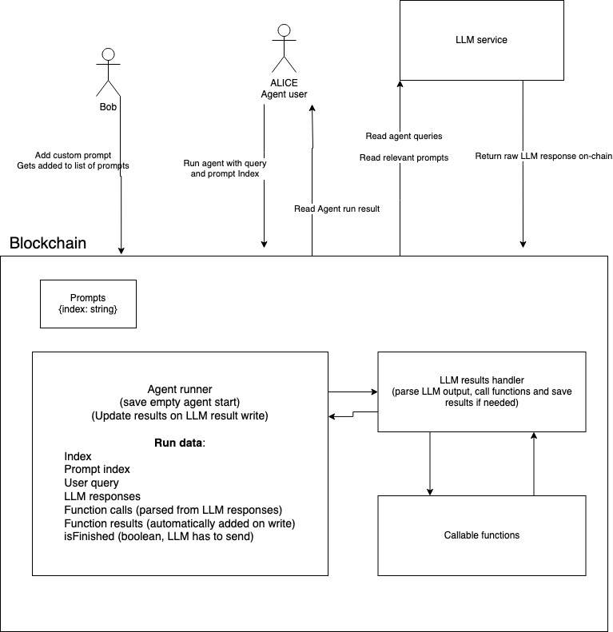

# agent

**agent** is a blockchain built using Cosmos SDK and Tendermint and created with [Ignite CLI](https://ignite.com/cli).

## Get started

```
ignite chain serve
```

`serve` command installs dependencies, builds, initializes, and starts your blockchain in development.

### Configure

Your blockchain in development can be configured with `config.yml`. To learn more, see
the [Ignite CLI docs](https://docs.ignite.com).

# Application flow

Basic setup

```bash
ignite scaffold chain agent
cd agent
ignite chain serve

ignite generate composables (NOT NEEDED?)
```

### Helpful commands

Generate type

```bash
ignite scaffold type agentrun prompt:uint query:string responses:array.string functioncalls:array.string functionresults:array.string isfinished:bool id:uint
```

Generate write endpoint

```bash
ignite scaffold message add-response response isfinished:bool runid:uint --response id:uint
```

Generate read endpoint

```bash
ignite scaffold query get-agent-run id:uint --response run:Agentrun
```

## Agent flow

- User posts text on chain
- "Model" queries text and posts answer(s) on chain
- If text contains function call then the answer pushing endpoint also saves function response




## "e2e" demo

Get runnable txs

```bash
agentd tx agent --help
```

Prompts

```bash
agentd tx agent add-prompt "You are a smart agent" --from alice --chain-id agent
agentd q agent get-prompt 0
```

Add query for agent on-chain

```bash
agentd tx agent run-agent "whats 8 multiplied by 4?" 0 --from alice --chain-id agent
agentd q agent get-agent-run 0
```

Agent Polls blockchain

```bash
agentd q agent get-agent-run 0
```

Agent raw response is sent on chain, agent queries result on state, agent sends next result

```bash
agentd tx agent add-response "Thinking..." false 0 --from bob --chain-id agent
agentd tx agent add-response "F_CALL: MultiplyBy8(\"4\")" false 0 --from bob --chain-id agent
agentd q agent get-agent-run 0
agentd tx agent add-response "8 multiplied by 4 is 32" true 0 --from bob --chain-id agent
```

End result of this example
```
(base) kristjanpeterson@Kristjans-MacBook-Pro agent % agentd q agent get-agent-run 2                                                           
run:
  functioncalls:
  - MultiplyBy8("4")
  functionresults:
  - "32"
  id: "2"
  isfinished: true
  query: whats 8 multiplied by 4?
  responses:
  - Thinking...
  - 8 multiplied by 4 is 32
```